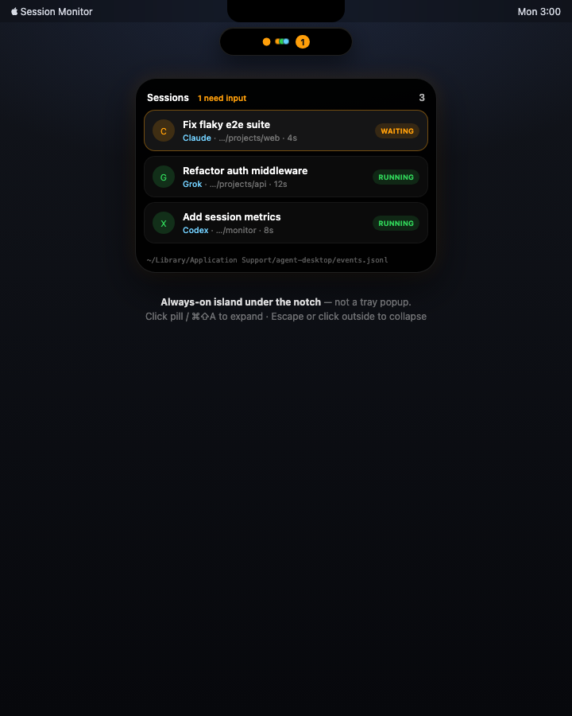
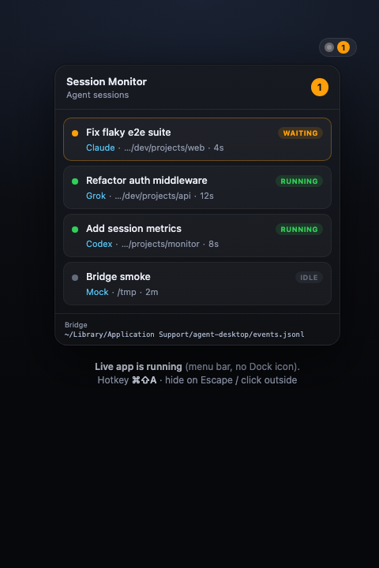

# Session Monitor

[](https://github.com/KolyshkinYafim/session-monitor/actions/workflows/ci.yml)

> Ambient control surface for AI coding agent sessions (Vibe Island–class).

A **native macOS** menu-bar "island" HUD (Swift / AppKit + SwiftUI). It tails the Chat Hub
event bridge and surfaces live agent sessions — statuses, a waiting-input badge, and quick
reply — as a floating pill at the top-center of the display. Terminal sessions report in
through the hook scripts in [`hooks/`](./hooks/README.md): Claude Code, Codex and Grok fire
hooks, OpenCode loads a plugin, and they all land in the same island — no Chat Hub required.

Primary UX is **not** a centered document window and **not** only a tray dropdown.



**Requirements:** macOS 14+ (deployment target 14.0). Building needs Xcode 26 / Swift 6.2
(verified with Xcode 26.1).

## Vibe Island (notch-native)

Sits **in** the menu-bar / notch band (like Vibe Island), not as a ghost pill under the curtain:

- **Compact / activity strip** — height = menu bar; **left wing** = live session icons, **center** = hardware notch (empty), **right wing** = waiting badge / live count
- **Expanded** — board drops **down** from the strip; list content is below the notch (never clipped under it)
- Modes: `compact` → `activity` → `expanded` (no invisible 4px tuck)
- Click strip / ⌘⇧A → expand; Esc / click-outside → collapse; idle 10s → compact (still visible)
- OS notifications: `waiting_input` / `done` / `error`
- Source: **Chat Hub JSONL bridge** (+ optional `SESSION_MONITOR_MOCK=1`)

```
  [icons] ████ NOTCH ████ [badge]     ← strip in menu bar band
           ┌──────────────────┐
           │ Sessions board   │       ← expands downward only
           └──────────────────┘
```

## Install

```bash
packaging/install-app.sh
```

Builds Release, stamps the build identity (`BuildIdentity.plist` — git revision + date, so
the installed app is always traceable to a tree), ad-hoc signs, and installs to
`/Applications/SessionMonitor.app`. Re-runnable; undo with `packaging/uninstall-app.sh`.
Then wire up terminal agents with `hooks/install.sh` (or the "Install / repair Claude hooks"
button in Settings → Integrations).

## Run from source

```bash
open SessionMonitor/SessionMonitor.xcodeproj
```

Xcode → scheme **SessionMonitor** → **My Mac** → Run (⌘R). Hotkey: **⌘⇧A** to expand/collapse.

Or build/run from the CLI:

```bash
xcodebuild -project SessionMonitor/SessionMonitor.xcodeproj -scheme SessionMonitor -configuration Debug build
open ~/Library/Developer/Xcode/DerivedData/SessionMonitor-*/Build/Products/Debug/SessionMonitor.app
```

There is **no Dock document window** (`LSUIElement`-style ambient app). Enable the local demo
producer for UI testing with `SESSION_MONITOR_MOCK=1` (off by default).



## Bridge path

```
~/Library/Application Support/agent-desktop/events.jsonl   (Hub → Monitor)
~/Library/Application Support/agent-desktop/commands.jsonl  (Monitor → Hub)
```

Override: `AGENT_DESKTOP_EVENTS` / `AGENT_DESKTOP_COMMANDS`. See [docs/bridge.md](./docs/bridge.md).

## Docs

- [Product](./docs/product.md)
- [Architecture](./docs/architecture.md)
- [Bridge](./docs/bridge.md) — wire format, trim lock, permission socket (authoritative)
- [MVP](./docs/mvp.md)
- [Verification](./docs/VERIFICATION.md)
- [Remaining work](./docs/REMAINING-WORK.md)
- [Settings inventory](./docs/SETTINGS-INVENTORY.md) — Vibe Island parity, setting by setting
- [Hooks](./hooks/README.md) — what each hook emits, what gets installed where
- [Tests](./tests/README.md) — how to run the check scripts

## Layout

```
SessionMonitor/          Swift native island (Xcode project — the app)
hooks/                   Hook scripts: terminal Claude / Codex / Grok / OpenCode sessions report into the monitor
packaging/               install-app.sh — Release build, build-identity stamp, ad-hoc sign, install to /Applications
tests/                   Hook-contract suite (hook-events.sh) + permission-socket E2E (permission-e2e.sh)
docs/                    Product / architecture / bridge docs + screenshots
```
